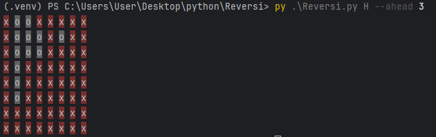

# Reversi-Othello-Minimax-AI-Project
This project was developed as part of an Introduction to Artificial Intelligence course. It implements the board game Reversi (Othello) with an AI agent based on the Minimax algorithm with Alpha-Beta pruning, written entirely in Python.

The project demonstrates hands-on experience with:

- Search algorithms
- Game state modeling
- Heuristic evaluation
- Clean and modular Python code

## Project Goals

- Implement the complete game logic of Reversi  
- Model game states and legal actions  
- Apply **Minimax with Alpha-Beta** pruning for decision making  
- Design heuristic evaluation functions for non-terminal states  
- Maintain a clear and modular code structure  

## AI Techniques Used

- Minimax Algorithm  
- Alpha-Beta Pruning  
- Heuristic Evaluation Function  
- Depth-limited game tree search


## Heuristic Evaluation
- **Disk difference:** The difference between the number of disks owned by each player. This provides a basic measure of advantage.
- **Blocked disks:** Disks that cannot be flipped in future moves are considered more stable and therefore more valuable.
- **Move quality estimation:** The heuristic also considers the average number of opponent disks that can be flipped in possible future moves, favoring positions with stronger potential actions.


## Project Description

The project simulates a full Reversi game between two players, where moves can be selected either naively or by an AI agent.  
The AI player evaluates future game states using Minimax search with Alpha-Beta pruning to reduce the number of explored states.  
A heuristic function is used when the search depth limit is reached, taking into account:  
- Disk difference between players
- Blocked disks
- Average number of disks flipped per move

## How to Run

Run a full game using the Minimax AI:
```
python Reversi.py H --ahead 4
```
Display all possible legal actions after a given number of moves:
```bash
python Reversi.py --displayAllActions 7
```
Run a step-by-step game using naive move selection:
```bash
python Reversi.py --methodical 5
```
## Requirements

- Python 3.x
- NumPy

Install dependencies:
```bash
pip install numpy
```

##  Example Run 
Example of running a game with a minimax tree to depth 3 and calculating the heuristics



## Skills Demonstrated

- Artificial Intelligence fundamentals
- Game-tree search algorithms
- Heuristic design and evaluation
- Object-oriented programming in Python
- Writing clean, maintainable, and well-documented code
